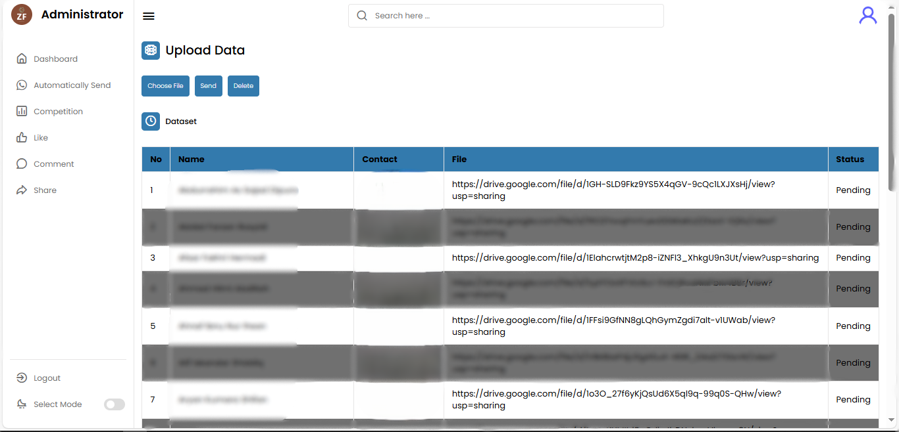
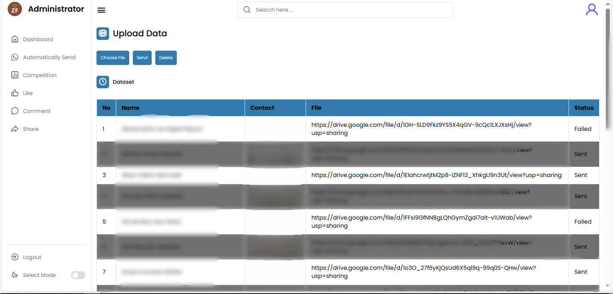
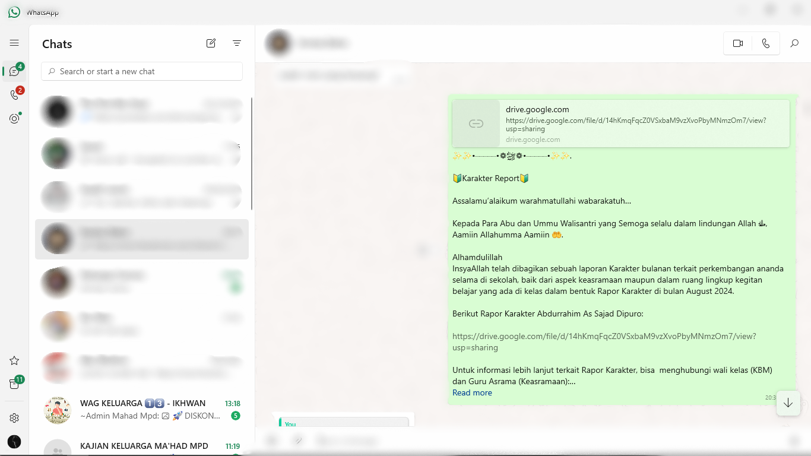

# Automation Whatsapp

This project is a simple program to send one-click whatsapp messages to multiple recipients, equipped with word templates.

Created using python with the Flask framework to make it a dynamic website and for whatsapp automation using the Selenium framework which is directly integrated with the chrome driver.

## Environment Variables

To run this project, you will need to add the following API KEY for Chrome Driver.

`API_KEY` ==> Chrome Driver

## Tech Stack

- HTML
- CSS
- Javascript
- Python
- Flask
- Selenium

## Roadmap

- Additional browser support (Chrome)

- Uploaded file with CSV or Excel

- Pre-word template

- Automation Whatsapp Sending

## Screenshots

To be able to run the program, the first thing to prepare is to import the dataset. Then click the submit button then wait for the program to run and will open web chrome automatically. You only need to wait for the program to send an automatic message until it is finished.

### First Step is Upload Dataset

### Second Step Click Send Button

Look at the status column indicating the result of the sent message whether successful or failed.

Note: Don't forget to set up a login to whatsapp web when chrome opens

Results of messages that have been successfully sent

